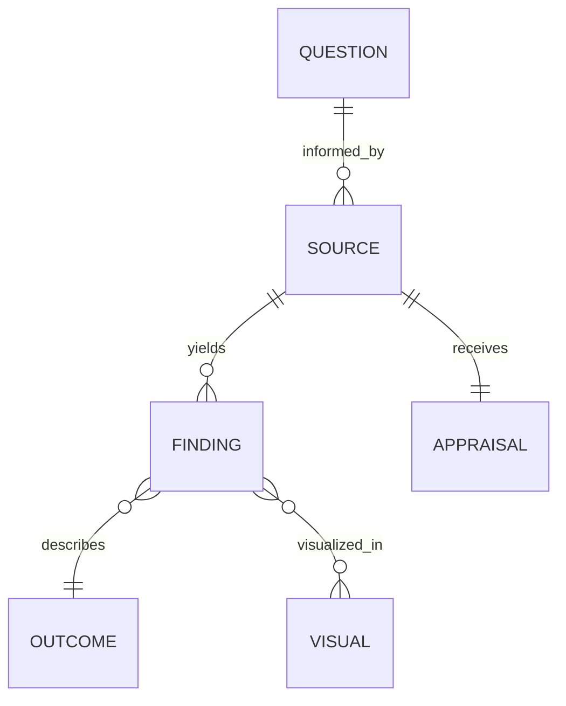
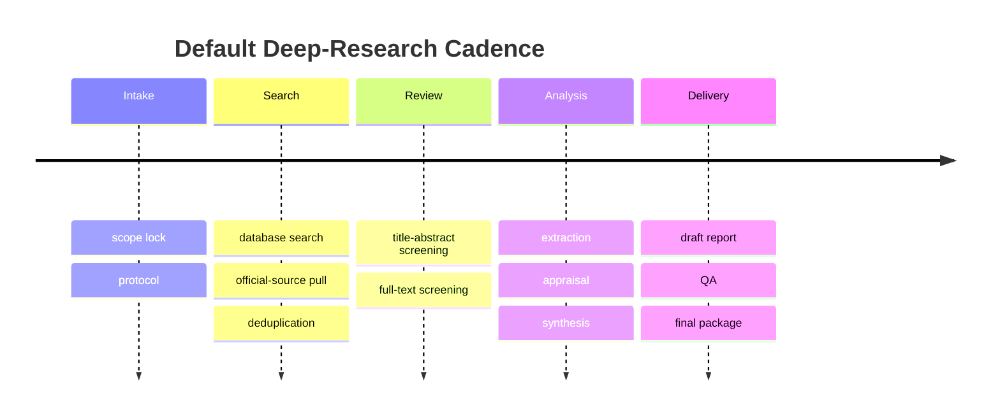

# Deep Research Blueprint for a Topic To Be Specified

## Executive Summary

Because the topic is still unspecified, the highest-value output is not a findings report but a **research protocol scaffold** that can be instantiated quickly once the subject, decision context, and audience are known. A rigorous default should include a protocol, a transparent multi-database search, peer review of search strategies, design-appropriate critical appraisal, certainty grading where relevant, and reproducible appendices for search logs, extraction sheets, and source inventories. PRISMA 2020 provides the backbone for transparent reporting of systematic reviews; PROSPERO and OSF Registries support protocol transparency; PRESS supports peer review of electronic search strategies; and GRADE provides a structured approach to assessing certainty of evidence. citeturn10search3turn8search0turn8search20turn10search8turn13search2

This blueprint is designed to work across domains, but the source hierarchy should always favor **official or primary records first**, then original studies, then syntheses, with commentary and news used mainly for discovery or context. For example, PubMed and PMC support biomedical discovery and full text; ClinicalTrials.gov is a registry and results database; Crossref and OpenAlex are strong discovery layers for scholarly metadata; and official public records such as SEC EDGAR, GovInfo, USPTO Patent Public Search, FDA databases, World Bank WDI, OECD Data, and UNdata become central when the eventual topic is business, legal, technical, regulatory, or policy-oriented. citeturn4search0turn4search12turn4search1turn4search2turn4search11turn5search0turn6search19turn5search1turn5search2turn5search3turn9search2turn9search3

One uploaded document already appears to be a possible future topic seed: a prompt centered on a multi-signal quantitative trading framework. If that is the intended subject, this generic blueprint should be specialized toward market microstructure data, regulatory filings, exchange data, and original empirical finance research. fileciteturn0file0

## Research Questions and Hypotheses

A strong default is to define **one primary question**, **three to five secondary questions**, and **one falsifiable hypothesis for each major mechanism or claim**. Where the eventual topic is intervention- or effect-oriented, Cochrane recommends planning the review PICO at the protocol stage because that PICO determines both eligibility and the way syntheses are structured. citeturn11search7turn11search0

| Question family | Generic research question template | Draft hypothesis template | Evidence needed |
|---|---|---|---|
| Scope and definition | What exactly is **[topic]**, and how is it defined across authoritative sources? | Definitions converge on a core construct but differ at the margins. | Official definitions, standards, regulatory texts, review articles |
| Baseline and prevalence | How common, large, or economically/clinically significant is **[topic]**? | Reported prevalence/importance varies by geography, timeframe, and measurement method. | Official statistics, registries, large observational datasets |
| Causal or effectiveness | What effect does **[intervention/exposure/event]** have on **[outcome]**? | The effect is positive/negative/null after adjustment for confounding or comparator choice. | Trials, quasi-experiments, observational studies, meta-analyses |
| Mechanism | Through what pathways does **[topic]** produce the observed outcomes? | A limited number of mechanisms explain most of the observed variation. | Mechanistic studies, process evaluations, qualitative evidence |
| Comparative | Which approach, policy, product, or actor performs better, and under what conditions? | Relative performance depends on context, scale, and cost constraints. | Head-to-head studies, comparative case studies, benchmarks |
| Risk and downside | What are the main failure modes, harms, or trade-offs? | Benefits are concentrated, while risks scale with context or implementation choices. | Safety data, adverse-event reports, legal cases, post-market data |
| Implementation and policy | What works in practice, for whom, and in which settings? | Real-world implementation underperforms controlled settings because of constraints and heterogeneity. | Implementation studies, policy evaluations, operational reports |
| Forward view | What are the plausible next developments over the next **[time horizon]**? | Near-term change is driven by a small number of technical, regulatory, or market catalysts. | Recent filings, standards, roadmaps, expert reports, longitudinal data |

A practical default is to validate each answer against four lenses: **what is claimed, how it is measured, what the counterevidence says, and how confident we should be**.

## Research Plan and Methodology

The default workflow should be: **scope lock → protocol → search design → retrieval → de-duplication → screening → full-text review → extraction → critical appraisal → synthesis → report package**. That sequence aligns with PRISMA-style transparent review reporting, JBI’s guidance on protocoling, search, data extraction, and results presentation, PRESS for search-strategy review, and GRADE for certainty assessment. PRISMA itself is a reporting framework and should not be used as a methodological quality score. citeturn10search3turn3search1turn3search4turn10search8turn13search2turn0search7

```mermaid
flowchart LR
    A[Scope lock] --> B[Protocol and hypotheses]
    B --> C[Search strategy design]
    C --> D[Database and official-source search]
    D --> E[Deduplicate and screen]
    E --> F[Full-text review]
    F --> G[Data extraction]
    G --> H[Critical appraisal]
    H --> I[Synthesis and uncertainty assessment]
    I --> J[Report, appendix, and evidence pack]
    J --> K[Update cadence if topic is fast-moving]
```

| Stage | Default method | Output |
|---|---|---|
| Scoping | Define decision context, audience, geography, timeframe, and outcomes before searching broadly. | Scope memo |
| Protocol | Record questions, hypotheses, eligibility rules, search plan, synthesis strategy, and version/date. | Protocol or preregistration |
| Search design | Build concept clusters, synonyms, acronyms, controlled vocabulary where available, and official-source queries; peer-review the strategy using PRESS. | Search strings and search log |
| Retrieval | Search discovery databases plus official repositories and topic-specific gray literature. | Raw source set |
| Screening | Apply title/abstract review, then full-text review against explicit criteria. | Included/excluded source ledger |
| Extraction | Use a piloted extraction form and capture quote-level support for major claims. | Extraction workbook |
| Appraisal | Match appraisal to design: reporting completeness with CONSORT or STROBE where relevant, and bias assessment with RoB 2 or ROBINS-I for randomized and non-randomized intervention studies. | Appraisal matrix |
| Synthesis | Use narrative synthesis by default; add meta-analysis or structured comparative synthesis only when designs and outcomes are sufficiently comparable. | Findings matrix and synthesis memo |
| Reproducibility | Archive protocol, searches, decisions, extraction, code, and figures in a versioned repository when feasible. | Appendix and archive package |

The distinction between **reporting guidance** and **bias appraisal** matters. CONSORT is the evidence-based reporting standard for randomized trials, STROBE supports reporting of observational studies, RoB 2 is Cochrane’s recommended bias tool for randomized trials, and ROBINS-I was developed for non-randomized intervention studies. citeturn7search13turn0search3turn12search1turn7search1

### Search-term templates

| Search purpose | Template |
|---|---|
| Landscape | `("<TOPIC>" OR synonym* OR acronym*) AND (overview OR landscape OR trend* OR taxonomy)` |
| Effect or impact | `("<TOPIC>" OR synonym*) AND (effect OR impact OR association OR causal OR outcome)` |
| Mechanism | `("<TOPIC>" OR synonym*) AND (mechanism OR pathway OR driver* OR mediator*)` |
| Risk and downside | `("<TOPIC>" OR synonym*) AND (risk OR limitation* OR harm* OR failure OR adverse)` |
| Official records | `site:.gov OR site:.int OR site:.org "<TOPIC>" filetype:pdf` |
| Patents or filings | `"<TOPIC>" AND (patent OR filing OR docket OR registration OR standard)` |
| Replication and validation | `("<TOPIC>" OR synonym*) AND (replication OR validation OR benchmark OR out-of-sample)` |
| Fresh-developments scan | `"<TOPIC>" AND (update OR latest OR guidance OR rule OR approval OR recall)` |

### Default inclusion and exclusion criteria

| Include by default | Exclude by default |
|---|---|
| Official, primary, or otherwise attributable sources | Anonymous or unverifiable claims |
| Original research and primary evidence | Pure opinion pieces without evidence base |
| Sources with methods, provenance, or identifiable methodology | Promotional material that lacks methods or data |
| Current versions of standards, laws, filings, registries, and datasets | Superseded versions unless needed historically |
| Sources directly answering one or more scoped questions | Tangential material with weak topical relevance |
| English-language sources unless the user later broadens language scope | Non-English sources only if translation is out of scope |

## Prioritized Source Universe

The source order should be driven by **proximity to the underlying claim**, not by convenience. Discovery layers are useful for finding material, but the strongest claim support usually comes from official records or original papers rather than tertiary summaries. Crossref and OpenAlex are especially useful for building a source map, citation expansion, and de-duplication. citeturn4search2turn4search11

| Priority | Source class | Likely examples | Why this tier matters |
|---|---|---|---|
| Highest | User-supplied context | User notes, datasets, internal documents, and the uploaded quant prompt if that is the actual topic. fileciteturn0file0 | Clarifies the real decision context before public searching expands the scope. |
| Highest | Official primary records | ClinicalTrials.gov, FDA drug databases, SEC EDGAR, GovInfo, USPTO Patent Public Search, World Bank WDI, OECD Data, UNdata. citeturn4search1turn5search2turn5search0turn6search19turn5search1turn5search3turn9search2turn9search3 | Closest to the institutional event, filing, approval, statistic, or legal record. |
| High | Original scholarly literature | PubMed and PMC for biomedical literature; arXiv and SSRN for early dissemination; RePEc and EconLit for economics; publisher full text after discovery. citeturn4search0turn4search12turn6search0turn6search1turn9search4turn9search1 | Best source for methods, data, and original empirical claims. Preprints and working papers must be labeled clearly. |
| High | Discovery and metadata layers | Crossref REST API, OpenAlex. citeturn4search2turn4search11 | Excellent for citation chasing, metadata enrichment, funding relationships, and bibliographic completeness. |
| Medium | Synthesis and method anchors | Cochrane, JBI Manual for Evidence Synthesis, PRISMA, GRADE, EQUATOR, STROBE, CONSORT. citeturn12search5turn3search1turn10search15turn13search0turn7search7turn0search3turn7search13 | Best for consensus, review structure, certainty grading, and reporting completeness. |
| Medium | Open-science infrastructure | PROSPERO, OSF Registries, Dataverse, REDCap, optional screening tools such as Covidence. citeturn8search0turn8search20turn8search3turn3search2turn3search3 | Supports preregistration, data capture, archiving, collaboration, and reproducibility. |
| Lower | Gray literature and contextual reporting | Government reports, think-tank papers, standards, conference proceedings, technical notes, practitioner reports. | Useful for implementation details, recent developments, and negative or unpublished evidence, but should be triangulated against primary records. |

A useful default rule is: **read the primary record first, use syntheses second, and treat commentary as a lead rather than a conclusion**.

## Extraction and Synthesis Templates

JBI explicitly provides adaptable extraction instruments for evidence synthesis, and standardized tooling such as REDCap and Covidence can support structured collection and review workflows when the project becomes operational. citeturn3search4turn3search2turn3search3

### Source extraction table

| Field | What to capture |
|---|---|
| Source ID | Unique ID for traceability |
| Citation | Full citation or filing title |
| Source type | Trial, registry, filing, paper, patent, policy document, dataset |
| Question answered | Which research question this source informs |
| Claim extracted | Exact claim or finding supported by the source |
| Context | Geography, sector, population, market, or setting |
| Timeframe | Publication date and evidence period covered |
| Method or design | RCT, cohort, case study, time series, administrative data, filing, etc. |
| Inputs/data | Data source, sample size, variables, model, benchmark |
| Outcome metric | Measure used, units, directionality |
| Main result | Effect size, estimate, qualitative finding, or event detail |
| Counterpoints | Limitations, contrary evidence, sensitivity conditions |
| Funding/conflicts | Funding source, disclosed conflicts, issuer interest |
| Reliability note | Primary/secondary, peer-reviewed/preprint, official/unofficial |
| Appraisal result | RoB 2, ROBINS-I, STROBE/CONSORT completeness, or domain-specific quality note |

### Synthesis matrix

| Research question | Evidence supporting | Evidence contradicting | Net finding | Confidence | What would change the conclusion |
|---|---|---|---|---|---|
| Primary question | Source IDs | Source IDs | Short conclusion | High / Medium / Low | Key missing study, dataset, event, or comparator |
| Secondary question A | Source IDs | Source IDs | Short conclusion | High / Medium / Low | Same |
| Secondary question B | Source IDs | Source IDs | Short conclusion | High / Medium / Low | Same |

### Suggested visuals

| Visual | Best use | Inputs needed |
|---|---|---|
| Timeline | Regulatory, scientific, or market chronology | Event date, event type, source |
| Flowchart | Mechanism, process, or decision logic | Nodes, causal links, dependencies |
| ER diagram | Entities, actors, datasets, or evidence relationships | Entity list and relationships |
| Forest plot | Comparable quantitative effect estimates | Point estimates, intervals, weights |
| Heatmap | Evidence strength by question and source | Confidence or quality scores |
| Geographic map | Location-based exposure, policy, or adoption patterns | Region-level values |
| Network diagram | Citation, actor, or supply-chain relationships | Nodes and edges |
| Primary-source image pack | Patent figures, regulator diagrams, architecture drawings, maps, or screenshots from official reports | Topic-specific document set |

## Timeline and Deliverables

The hours below are **planning estimates**, not benchmarked norms. They assume one lead researcher, English-language scope, moderate topic complexity, and no large-scale meta-analysis. If the topic is fast-moving, it can be converted into a living-review cadence with scheduled updates and versioned outputs. citeturn0search14

| Task | Deliverable | Estimated hours |
|---|---|---:|
| Scope lock and stakeholder brief | One-page scope memo, audience, use case, key outcomes | 2–4 |
| Protocol and hypothesis design | Protocol, question set, inclusion/exclusion rules | 3–5 |
| Search architecture | Search strings, database list, official-source list, PRESS-style check | 3–6 |
| Retrieval and de-duplication | Master bibliography and source inventory | 2–4 |
| Screening | Title/abstract and full-text decisions log | 6–12 |
| Data extraction | Structured extraction workbook | 8–16 |
| Critical appraisal | Appraisal matrix and confidence notes | 4–8 |
| Synthesis | Findings matrix, contradiction log, draft visuals | 6–10 |
| Report drafting | Executive summary, report body, appendices | 4–6 |
| QA and revision | Citation audit, gap check, final polish | 2–4 |
| **Total** | **Full deep-research package** | **40–75** |

A sensible default final package is: **executive summary, full report, source register, extraction workbook, appraisal table, and a short “decision memo” translating the findings for the intended audience**.

## Limitations, Biases, and Ethics

The largest default risks are **publication bias, database coverage bias, time-lag bias, language restrictions, preprint overreliance, jurisdiction mismatch, conflicts of interest, and weak reproducibility when search logs, decision logs, data, and code are not preserved**. PROSPERO and OSF explicitly position registration and preregistration as transparency mechanisms, and the National Academies highlights transparency, reproducibility, and preservation of digital artifacts as core research-quality concerns. citeturn8search0turn8search20turn10search10turn10search2

| Risk | How it can distort conclusions | Default mitigation |
|---|---|---|
| Publication bias | Positive findings dominate; nulls are undercounted | Search gray literature, registries, and official datasets |
| Coverage bias | A single database misses key studies or records | Use multiple discovery layers plus official repositories |
| Time-lag bias | Old evidence crowds out recent changes | Apply a dated update scan late in the project |
| Preprint bias | Unreviewed claims are mistaken for established evidence | Label preprints clearly and verify against later peer-reviewed or official sources |
| Conflict-of-interest bias | Sponsor incentives shape framing or outcome emphasis | Capture funding, disclosures, and issuer interests in extraction |
| Jurisdiction mismatch | Evidence from one country/market is generalized too broadly | Record geography and legal/regulatory context for every key source |
| Survivorship or availability bias | Only easy-to-find data are analyzed | Explicitly log unavailable, inaccessible, or missing evidence |
| Reproducibility risk | Search and coding choices cannot be audited later | Archive protocol, searches, extraction tables, and code in a versioned repository |

For preprints specifically, arXiv describes itself as an open-access archive and states that materials posted there are not peer-reviewed by arXiv, while SSRN describes its networks as open-access preprint servers and early-stage research venues. Those sources can be highly useful for freshness, but they should be labeled and triangulated. citeturn6search0turn6search1

Ethically, the review should also avoid overstating certainty, especially where evidence is sparse, proprietary, commercially conflicted, or highly recent. When the eventual topic carries policy, medical, financial, or legal consequences, the report should clearly separate **facts, inferences, and scenario analysis**.

## Follow-Up Questions to Refine Scope

| Checklist item | Question to ask the user |
|---|---|
| Topic definition | What exact topic, claim, company, technology, policy, or event should the report evaluate? |
| Decision context | What decision is this research supposed to inform: investment, policy, strategy, procurement, litigation, clinical use, or general understanding? |
| Audience | Who is the end reader: executive, technical expert, legal team, investor, policymaker, or general audience? |
| Geography | Which country, market, regulator, or jurisdiction matters most? |
| Time horizon | Should the report emphasize historical background, the last 12–24 months, or forward-looking developments? |
| Evidence types | Should the research prioritize official records, original papers, market data, patents, clinical evidence, expert commentary, or some blend? |
| Deliverable style | Do you want a narrative briefing, evidence matrix, competitor comparison, annotated bibliography, or full systematic-style report? |
| Confidence threshold | Is a “best available evidence” answer acceptable, or do you want a higher bar such as only peer-reviewed / official / replicated evidence? |
| Update model | Should this be a one-time report or a living brief that gets refreshed periodically? |
| Uploaded prompt check | Is the uploaded quantitative-trading prompt the actual topic seed, or should it be ignored while we wait for the real topic? fileciteturn0file0 |

When the topic is finally specified, this scaffold can be converted into a topic-specific research package very quickly by replacing the placeholders in the question set, source hierarchy, and extraction templates.